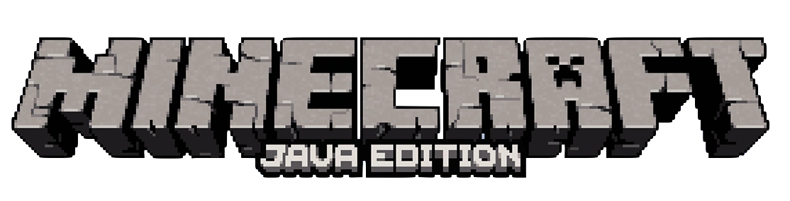

# שלום 👋
קראו את הדף הזה בשפה שלכם\

## אודות
היי, אני דוד בן 17\
אני דייג'י, מפיק מוזיקה, מתרגם, מתכנת ועוד המון\
אני מנהל ומייסד שתי חברות [side_or_slide music](https://www.youtube.com/c/sideorslideMusic) & [IMS - Network](https://israelmincraftml.wixsite.com/ims-network)
### סטאטוס ב-Git-Hub
\

### צרו קשר איתי

## העבודה שלי
### חברת IMS - Network
נוסדה בשנת 2020, במטרה פשוטה ליצור שרתי משחקים לכולם בחינם
> שלום, אנחנו IMS - Network. 👋\
אנחנו קבוצה של אנשים שמשקיעה זמן בשיפור השרתים שלנו ובקהילת המשחקים הישראלית. ✌️\
אנחנו בונים, מפתחים, ומתחזקים שרתי משחקים בחינם לכולם.😇\
כל הצוות שלנו עושה זאת ברצון, המטרה שלנו היא לכסות כמה שיותר משחקים ולדאוג לאיכות ובטיחות המשחק הטובה ביותר. 🤩\
#### צרו קשר

### מוזיקה SOS Music (side_or_slide)
נוסדה בשנת 2018, המקום שבו אני מראה את כישורי המוזיקה והידע שלי\
>בערוץ היוטיוב - side_or_slide, תוכלו  למצוא מוזיקה מדהימה באיכות הכי גבוהה שאפשר🎧\
סטייל המוזיקה שלנו הוא psytrance , progressive🎚️\
בכל העלאה אנו ממשיכים לעשות את המיטב כדי לשפר ולגדל את הקהילה שלנו ✨\
כמו כן, אנו מנסים להפוך את החוויה לפשוטה ככל האפשר😌\
אנחנו בעד ליצור עולם של שלום, אהבה ושמחה ❤️\
אז התכוננו  להרפתקה הטובה ביותר בחייכם 🤩\
זכרו "live Before You Die"🥂\
אם מישהו מוצא מוזיקה שלו בסרטון שלנו, נא לבדוק את התיאור 🧐\
המשך יום נעים‼ ️\
#### צרו קשר

## פרוייקטי תרגום לעברית
### מה?
אני מקדיש את זמני לתרגום שירותים שעוזרים לי ולאנשים אחרים (מאנגלית לעברית).\ 
זה עוזר להרבה אנשים למצוא מידע ולגלות דברים חדשים.
### פרוייקטים
#### 
הפלאגין LuckPerms הוא תוסף הרשאות עבור שרתי Minecraft (Bukkit/Spigot, BungeeCord ועוד). זה מאפשר למנהלי שרת לשלוט באילו תכונות שחקנים יכולים להשתמש על ידי יצירת קבוצות והקצאת הרשאות.
##### Links

##### GitHub Info

#### 
The original version of Minecraft! Java Edition has cross-platform play between Windows, Linux and macOS, and also supports user-created skins and mods.
##### Links

#### Minecraft Windows 10 & Bedrock
Explore infinite worlds and build everything from the simplest of homes to the grandest of castles. Create, explore, and survive alone or with friends on mobile, PC, and console devices.
##### Links

#### OBS Studio
Free and open source software for video recording and live streaming.
##### Links

##### GitHub Info

#### Lunacy
Free design software that keeps your flow with AI tools and built-in graphics. Lunacy works fast and smoothly. It’s not a sluggish browser wrapped in Electron and pretending to be an app. Share a documents with your team and edit it together. Side by side. In real-time. Or watch what others are doing, exchange comments, and get feedback. We have a great team of Lunacy enthusiasts helping us with localization of the app interface. Big thanks to them for helping other users who are not comfortable with English.
##### Links

* [Stay Hydrated](https://www.gndzkrkc.com/stayhydrated/)
* [Heads-up Notifications](http://simen.codes/app/android-5-headsup-notifications/)
* [Lunacy](https://icons8.com/lunacy)
* [Deep Rock Galactic](https://store.steampowered.com/app/548430/Deep_Rock_Galactic/)- 30% Done (5/16/2022)
* [IMS - Network Minecraft (My Own)](https://israelmincraftml.wixsite.com/ims-network)
* [ItemsAdder(A Minecraft Plugin)](https://spigot.devs.beer/itemsadder/)
* [Be My Eyes iOS](https://www.bemyeyes.com/)
